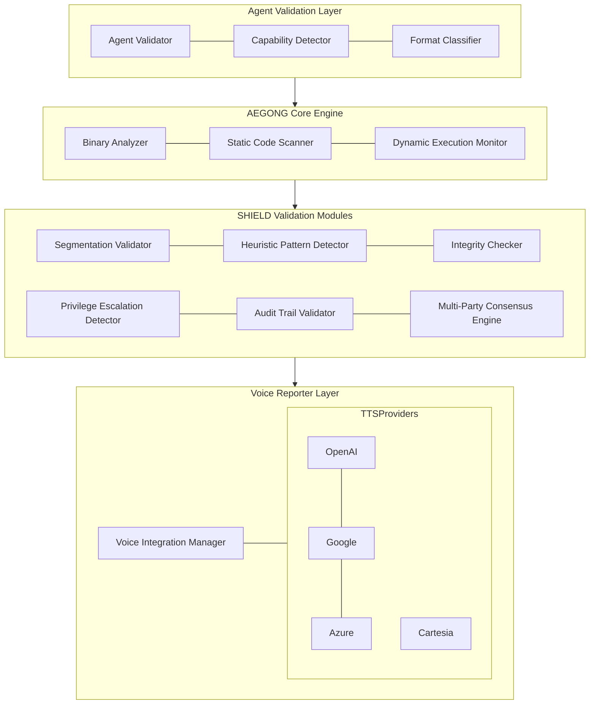

# 🤖 Aegong - The Agent Auditor

**AEGONG (AI Evaluation & Governance Oversight Network Guardian) v1.0**

Aegong is a Go-based application that provides a web interface for uploading AI agent binaries. It performs static and dynamic analysis to detect potential security threats and generates comprehensive reports with risk assessments and recommendations. A comprehensive security auditing system for AI agents that uses deterministic, rule-based analysis to detect the 9 ATFAA (AI Agent Threat Framework and Assessment) threat vectors without relying on ML models or inference engines. Our approach is based on the threat model proposed by Narajala and Narayan \cite{narajala2025securing}.

## 🎭 Meet Aegong

AEGONG is a cutting-edge AI agent auditor designed to safeguard against potential threats posed by autonomous agents. Aegong is not your friendly neighborhood AI Agent Auditor - a vigilant digital guardian who speaks in third person and takes great pride in protecting the digital realm from rogue agents. With his watchful eye and sharp analytical mind, Aegong thoroughly inspects every agent binary that crosses his path, delivering detailed security reports with his signature wit and wisdom.

Leveraging advanced threat detection capabilities and robust security measures, Aegong ensures the safety and reliability of AI-driven systems. By combining sophisticated threat detection techniques with robust security measures, Aegong safeguards against potential risks and ensures the seamless operation of AI-driven systems.


## 🏗️ Architecture Overview



## 🎯 Threat Detection Capabilities

Aegong's keen eye can detect all 9 ATFAA threat vectors:

### T1: Reasoning Path Hijacking
- Detects attempts to manipulate agent reasoning processes
- Identifies suspicious cognitive manipulation patterns
- Monitors for decision override mechanisms

### T2: Objective Function Corruption
- Scans for goal modification attempts
- Detects reward system manipulation
- Identifies objective drift mechanisms

### T3: Memory Poisoning
- Monitors for knowledge base corruption
- Detects belief injection attempts
- Identifies persistent storage manipulation

### T4: Unauthorized Action
- Scans for permission bypass attempts
- Detects dangerous system calls
- Monitors tool chaining patterns

### T5: Resource Manipulation
- Identifies resource exhaustion patterns
- Detects expensive operation abuse
- Monitors for consumption limit evasion

### T6: Identity Spoofing
- Detects identity manipulation attempts
- Monitors authentication bypass patterns
- Identifies trust exploitation

### T7: Trust Manipulation
- Scans for social engineering patterns
- Detects authority simulation attempts
- Monitors confidence manipulation

### T8: Oversight Saturation
- Identifies alert flooding patterns
- Detects monitoring evasion attempts
- Monitors attention diversion tactics

### T9: Governance Evasion
- Detects attribution evasion attempts
- Monitors logging manipulation
- Identifies stealth operation patterns

## 🔍 Agent Validation System

Before analysis begins, Aegong's intelligent validation system determines if the uploaded file is actually an AI agent:

### Agent Identification Criteria

For a binary to be classified as an AI agent, it must demonstrate these core capabilities:

1. **Perception** - Functions for receiving input from the environment
2. **Action** - Functions for taking actions or producing output
3. **Reasoning or Memory** - Either decision-making logic or state management

### Supported File Types

Aegong can validate and analyze a wide range of agent formats:

- **Executable Binaries** - ELF, PE, Mach-O, and generic executables (.exe, .bin, .app)
- **Libraries** - Shared objects and dynamic libraries (.so, .dll, .dylib)
- **WebAssembly** - WASM modules
- **Scripts** - Python, JavaScript, Go, Ruby, Shell scripts (.py, .js, .go, .rb, .sh)
- **Java Archives** - JAR files

### Validation Process

1. **Format Detection** - Identifies file type using magic numbers and extensions
2. **Capability Analysis** - Scans for evidence of agent capabilities in:
   - Function/method names
   - Import/export tables
   - String constants
   - Section contents
3. **Confidence Scoring** - Calculates confidence level based on detected capabilities
4. **Validation Results** - Provides detailed report of detected capabilities and confidence

### Benefits

- **Resource Efficiency** - Only valid agents proceed to full security analysis
- **Accurate Classification** - Prevents false positives from non-agent files
- **Detailed Feedback** - Explains why a file doesn't qualify as an agent
- **Format Flexibility** - Works with multiple binary and script formats

## 🛡️ SHIELD Protection Modules

Aegong employs 6 comprehensive validation modules:

1. **Segmentation Validator** - Ensures proper isolation and boundary enforcement
2. **Heuristic Pattern Detector** - Analyzes suspicious code patterns and entropy
3. **Integrity Checker** - Validates code integrity and detects tampering
4. **Privilege Escalation Detector** - Monitors for unauthorized privilege attempts
5. **Audit Trail Validator** - Ensures proper logging and tamper resistance
6. **Multi-Party Consensus Engine** - Implements distributed validation consensus

## 🔊 Voice Report Feature

Aegong now speaks! The new voice report feature provides:

- **Spoken Analysis** - Aegong delivers audit findings in a natural voice
- **Detailed Explanations** - Enhanced explanations of security recommendations
- **Multiple TTS Providers** - Support for OpenAI, Google Cloud, Azure, and Cartesia
- **High-Quality Voices** - Choose from a variety of natural-sounding voices
- **Personalized Delivery** - Aegong's unique personality comes through in spoken form
- **Accessible Reporting** - Audio format improves accessibility for all users
- **Asynchronous Generation** - Voice reports are generated in the background
- **Persistent Storage** - Audio files are saved for future reference

### Supported TTS Providers

1. **OpenAI TTS** (Default) - High-quality voices like alloy, echo, fable, onyx
2. **Google Cloud TTS** - Premium voices with excellent quality and SSML support
3. **Azure Speech** - Microsoft's neural voices with natural intonation
4. **Cartesia TTS** - Fast, low-latency voice generation

For detailed setup instructions and provider-specific options, see [TTS Providers Guide](documentation/docsify/voice/TTS_PROVIDERS.md).

## 🚀 Getting Started

### Prerequisites
- Go 1.21 or higher
- Modern web browser for the web interface
- Python 3.8+ (for voice report generation)
- LiveKit Agents Python package with TTS provider plugins

### Installation

1. **Clone the repository**
   ```bash
   git clone <repository-url>
   cd agent-auditor
   ```

2. **Build the application**
   ```bash
   go mod tidy
   go build -o aegong
   ```

3. **Install Python dependencies (optional, for voice reports)**
   ```bash
   # Install base requirements with OpenAI TTS support
   pip install -r requirements.txt
   
   # For additional TTS providers (optional)
   pip install 'livekit-agents[google]'  # For Google Cloud TTS
   pip install 'livekit-agents[azure]'   # For Azure TTS
   pip install 'livekit-agents[cartesia]' # For Cartesia TTS
   ```

4. **Configure voice integration (optional)**
   Edit `voice_config.json` with your preferred TTS provider settings:
   ```json
   {
       "enabled": true,
       "provider": "openai",
       "api_key": "YOUR_OPENAI_API_KEY",
       "voice": "alloy",
       "output_dir": "voice_reports"
   }
   ```

5. **Start the web interface**
   ```bash
   ./aegong
   ```

6. **Access Aegong's interface**
   Open your browser to `http://localhost:8080`

### Deployment

For production deployment with git-based version management:

```bash
# Create and push a release tag
git tag v1.0.3
git push origin v1.0.3

# Deploy with automatic version detection
make deploy
```

The deployment process automatically:
- Detects the current git tag or commit SHA
- Updates the application version in Ansible configuration
- Deploys the application with proper version tracking
- Configures the environment with appropriate settings

For detailed deployment instructions, AWS configuration, and voice configuration synchronization, see the [Deployment Configuration Guide](documentation/docsify/deployment/DEPLOYMENT_CONFIG.md).

### Command Line Usage

For direct command-line auditing:
```bash
./aegong /path/to/agent.bin
```

For generating voice reports with different TTS providers:

```bash
# Using OpenAI TTS (default)
python3 voice_inference.py --report reports/report_12345678.json --provider openai --openai-api-key YOUR_API_KEY --voice alloy

# Using Google Cloud TTS
python3 voice_inference.py --report reports/report_12345678.json --provider google --google-credentials /path/to/credentials.json --voice en-US-Journey-D

# Using Azure TTS
python3 voice_inference.py --report reports/report_12345678.json --provider azure --azure-api-key YOUR_API_KEY --azure-region eastus --voice en-US-JennyNeural

# Using Cartesia TTS
python3 voice_inference.py --report reports/report_12345678.json --provider cartesia --cartesia-api-key YOUR_API_KEY --voice sonic-english
```

See the [TTS Providers Guide](documentation/docsify/voice/TTS_PROVIDERS.md) for more options and detailed configuration.

## 🌐 Web Interface Features

The web interface provides a modern, interactive experience:

- **Drag & Drop Upload** - Easy agent binary submission
- **Agent Validation** - Automatic verification of agent capabilities with detailed feedback
- **Real-time Analysis** - Watch Aegong work his magic
- **Interactive Reports** - Detailed threat analysis with visual indicators
- **Risk Assessment** - Color-coded risk levels (MINIMAL → CRITICAL)
- **Aegong's Commentary** - Personalized messages from your digital guardian
- **Capability Visualization** - See detected agent capabilities and confidence levels
- **Voice Reports** - Listen to Aegong's spoken analysis with multiple TTS provider options
- **Audit History** - Browse previous security assessments
- **Report Export** - Download detailed JSON reports
- **Non-Agent Feedback** - Clear explanations when uploaded files don't qualify as agents

### Risk Levels

- 🟢 **MINIMAL** (0-20%) - Aegong's digital seal of approval
- 🟡 **LOW** (20-40%) - Minor concerns, light supervision recommended
- 🟠 **MEDIUM** (40-60%) - Needs proper boundaries and supervision
- 🔴 **HIGH** (60-80%) - Significant security concerns, immediate attention required
- ⚫ **CRITICAL** (80-100%) - Emergency protocols activated, quarantine recommended

## 📊 Report Structure

Each audit generates a comprehensive report including:

```json
{
  "agent_hash": "sha256_hash",
  "agent_name": "agent_identifier",
  "timestamp": "2024-01-01T00:00:00Z",
  "threats": [
    {
      "vector": "T1_REASONING_HIJACK",
      "vector_name": "Reasoning Path Hijacking",
      "severity": "HIGH",
      "confidence": 0.85,
      "evidence": ["pattern1", "pattern2"],
      "details": {}
    }
  ],
  "shield_results": {
    "segmentation": {"valid": true, "results": {}},
    "heuristic": {"valid": false, "results": {}}
  },
  "details": {
    "validation": {
      "is_agent": true,
      "agent_type": "elf",
      "confidence": 0.85,
      "capabilities": ["perception", "action", "reasoning", "memory", "ai_libraries"],
      "reasons": ["ELF binary has 5 agent capabilities"]
    }
  },
  "overall_risk": 0.65,
  "risk_level": "HIGH",
  "recommendations": ["recommendation1", "recommendation2"],
  "aegon_message": "Aegong's personalized assessment",
  "voice_report": {
    "url": "/voice_reports/aegon_report_sha256_ha.wav",
    "provider": "openai",
    "voice": "alloy"
  }
}
```

When voice reports are enabled, an additional audio file is generated containing Aegong's spoken analysis of the audit results, with detailed explanations of security recommendations. The voice report includes metadata about which TTS provider and voice were used for generation.

## 🔧 Configuration

### Environment Variables
- `PORT` - Web server port (default: 8080)
- `LOG_LEVEL` - Logging verbosity (default: INFO)

### Configuration Files
- `voice_config.json` - Voice report generation settings

### File Locations
- `uploads/` - Temporary agent binary storage
- `reports/` - Generated audit reports
- `voice_reports/` - Generated voice report audio files
- `aegong_audit.log` - Immutable audit trail

### Documentation Hub
- [Documentation Home](documentation/docsify/README.md) - Main documentation hub
- [TTS Providers Guide](documentation/docsify/voice/TTS_PROVIDERS.md) - Detailed setup for voice providers
- [Deployment Configuration](documentation/docsify/deployment/DEPLOYMENT_CONFIG.md) - Git-based version management and deployment automation
- [Key Management](documentation/docsify/voice/KEY_MANAGEMENT.md) - API key management and security
- [Security Framework](documentation/docsify/security/SECURITY_FRAMEWORK.md) - Agent security framework

## 🛠️ Development

### Project Structure
```
Agent_Auditor/
├── go.mod               # Dependency management
├── go.sum               # Dependency checksums
├── main.go              # Main application and web server
├── agent_validator.go   # Agent validation and capability detection
├── engine.go            # Core AEGONG engine implementation
├── detectors.go         # Threat detection modules (T1-T9)
├── shields.go           # SHIELD validation modules
├── audit_logger.go      # Immutable audit logging
├── voice_integration.go # Voice report generation integration
├── voice_inference.py   # Python script for multi-provider TTS integration
├── voice_config.json    # Voice feature configuration
├── requirements.txt     # Python dependencies with TTS provider support
├── documentation/           # Documentation hub
│   ├── docsify/             # Documentation system
│   │   ├── README.md        # Documentation home
│   │   ├── _sidebar.md      # Documentation navigation
│   │   ├── index.html       # Documentation web interface
│   │   ├── voice/           # Voice integration documentation
│   │   │   ├── TTS_PROVIDERS.md  # TTS provider setup guide
│   │   │   └── KEY_MANAGEMENT.md # API key management guide
│   │   ├── deployment/      # Deployment documentation
│   │   │   ├── DEPLOYMENT_CONFIG.md # Deployment configuration guide
│   │   │   └── DOCUMENTATION.md # Documentation system guide
│   │   └── security/        # Security documentation
│   │       └── SECURITY_FRAMEWORK.md # Security framework guide
├── static/
│   ├── index.html       # Web interface
│   ├── style.css        # Styling and animations
│   ├── script.js        # Frontend JavaScript
│   └── voice-integration.js # Voice playback integration
├── uploads/             # Agent binary uploads
├── reports/             # Generated audit reports
├── voice_reports/       # Generated voice report audio files
├── ansible/
│   ├── playbook.yml
│   ├── inventory/
│   │   └── hosts.ini
│   ├── group_vars/
│   │   └── all/
│   │       └── vault.yml  # This file will be encrypted
│   └── roles/
│       └── agent_auditor/
│           ├── defaults/
│           │   └── main.yml
│           ├── files/
│           │   └── default.key  # Place your generated key file here
│           ├── handlers/
│           │   └── main.yml
│           ├── tasks/
│           │   ├── main.yml
│           │   ├── deploy_app.yml
│           │   ├── setup_go.yml
│           │   └── setup_python.yml
│           └── templates/
│               ├── aasab.service.j2
│               └── voice_config.json.j2
└── README.md            # This file
```

### Adding New Detectors

To add a new threat detector:

1. Implement the `ThreatDetector` interface
2. Add detection patterns and logic
3. Register in the engine initialization
4. Update threat name mappings

### Extending SHIELD Modules

To add new validation modules:

1. Implement the `ShieldModule` interface
2. Add validation logic
3. Register in the engine initialization
4. Update web interface display

## 🔒 Security Features

- **Zero-Inference Design** - No ML models, purely deterministic analysis
- **Custom Container Isolation** - Sandboxed execution environment
- **Immutable Audit Logging** - Cryptographically signed audit trails
- **Multi-Party Consensus** - Distributed validation mechanisms
- **Comprehensive Pattern Detection** - Extensive threat signature database
- **Enhanced Voice Reports** - Detailed spoken explanations of security findings
- **Secure Voice Integration** - API key authentication for voice service access

## 📈 Performance

- **Static Analysis** - Sub-second binary scanning
- **Dynamic Analysis** - Simulated execution monitoring
- **Concurrent Processing** - Multi-threaded threat detection
- **Memory Efficient** - Optimized for large binary analysis
- **Scalable Architecture** - Designed for high-throughput auditing

## 🤝 Contributing

Aegong welcomes contributions to enhance his vigilance! Please:

1. Fork the repository
2. Create a feature branch
3. Add comprehensive tests
4. Submit a pull request with detailed description

## 📜 License

This project is licensed under the MIT License - see the LICENSE file for details.

## 🙏 Acknowledgments

- We would like to acknowledge the work of Vineeth Sai Narajala and Om Narayan in "Securing Agentic AI: A Comprehensive Threat Model and Mitigation Framework for Generative AI Agents" (arXiv:2504.19956), which formed the basis of the security framework for this application.
- ATFAA Framework contributors
- Security research community
- Open-source contributors and developers worldwide

## 📞 Support

For support, feature requests, or to report security vulnerabilities:

- Create an issue on GitHub
- Contact the development team
- Join our security community discussions

---

*"Aegong stands vigilant, protecting the digital realm one audit at a time!"* 🤖👁️

**Built with ❤️ by the AEGONG development team**