#  AEGONG - The Agent Auditor

**AEGONG (AI Evaluation & Governance Oversight Network Guardian) v1.0**

A comprehensive security auditing system for AI agents that uses deterministic, rule-based analysis to detect the 9 ATFAA (AI Agent Threat Framework and Assessment) threat vectors without relying on ML models or inference engines. Our approach is based on the threat model proposed by Narajala, V. S., & Narayan, O. (2025). Securing Agentic AI: A Comprehensive Threat Model and Mitigation Framework for Generative AI Agents. ArXiv. https://arxiv.org/abs/2504.19956.

## 🎭 Meet AEGONG  

AEGONG is a cutting-edge AI agent auditor designed to safeguard against potential threats posed by autonomous agents. Aegong is not your friendly neighborhood AI Agent Auditor - a vigilant digital guardian who speaks in third person and takes great pride in protecting the digital realm from rogue agents. With his watchful eye and sharp analytical mind, Aegong thoroughly inspects every agent binary that crosses his path, delivering detailed security reports with his signature wit and wisdom.

Leveraging advanced threat detection capabilities and robust security measures, Aegong ensures the safety and reliability of AI-driven systems. By combining sophisticated threat detection techniques with robust security measures, Aegong safeguards against potential risks and ensures the seamless operation of AI-driven systems.


## 🏗️ Architecture Overview

```mermaid
%%{init: {'theme': 'dark', 'themeVariables': { 'darkMode': true }}}%%
flowchart TB
    User(["👤 User"])
    
    subgraph LoaderGateway["🚀 Loader Gateway (Netlify)"]
        LoaderUI["Interactive Robot Game"]
        
        subgraph NetlifyFunctions["Netlify Functions"]
            StartFunc["start.js"]
            StatusFunc["status.js"]
        end
        
        LoaderUI --> NetlifyFunctions
    end

    subgraph EC2Instance["☁️ EC2 Instance"]
        subgraph ValidationLayer["Agent Validation Layer"]
            AV["Agent Validator"] --- CD["Capability Detector"] --- FC["Format Classifier"]
        end

        subgraph CoreEngine["AEGONG Core Engine"]
            BA["Binary Analyzer"] --- SCS["Static Code Scanner"] --- DEM["Dynamic Execution Monitor"]
        end

        subgraph ShieldModules["SHIELD Validation Modules"]
            SV["Segmentation Validator"] --- HPD["Heuristic Pattern Detector"] --- IC["Integrity Checker"]
            PED["Privilege Escalation Detector"] --- ATV["Audit Trail Validator"] --- MPCE["Multi-Party Consensus Engine"]
        end

        subgraph VoiceLayer["Voice Reporter Layer"]
            VIM["Voice Integration Manager"]
            
            subgraph TTSProvidersGroup["TTS Providers"]
                OpenAI --- Google --- Azure
                Cartesia
            end
            
            VIM --- TTSProvidersGroup
        end

        ValidationLayer --> CoreEngine
        CoreEngine --> ShieldModules
        ShieldModules --> VIM
    end

    %% Data flow from User through the system and back
    User --> LoaderUI
    LoaderUI --> NetlifyFunctions
    NetlifyFunctions --> EC2Instance
    ValidationLayer --> CoreEngine
    CoreEngine --> ShieldModules
    ShieldModules --> VIM
    VIM --> EC2Instance
    EC2Instance --> User
    
    %% High contrast colors for better visibility
    style User fill:#00796b,color:#ffffff,stroke:#004d40,stroke-width:2px
    style LoaderGateway fill:#1565c0,color:#ffffff,stroke:#0d47a1,stroke-width:2px
    style EC2Instance fill:#6a1b9a,color:#ffffff,stroke:#4a148c,stroke-width:2px
    style LoaderUI fill:#0288d1,color:#ffffff,stroke:#01579b,stroke-width:2px
    style NetlifyFunctions fill:#0097a7,color:#ffffff,stroke:#006064,stroke-width:2px
    style ValidationLayer fill:#7b1fa2,color:#ffffff,stroke:#4a148c,stroke-width:2px
    style CoreEngine fill:#8e24aa,color:#ffffff,stroke:#4a148c,stroke-width:2px
    style ShieldModules fill:#9c27b0,color:#ffffff,stroke:#4a148c,stroke-width:2px
    style VoiceLayer fill:#ab47bc,color:#ffffff,stroke:#4a148c,stroke-width:2px
    style TTSProvidersGroup fill:#ba68c8,color:#ffffff,stroke:#4a148c,stroke-width:2px
```



## 🚀 Interactive Loader Gateway

The Agent Auditor features an innovative **Interactive Loader Gateway** that serves as the entry point to the application. Instead of a boring loading screen, users are greeted with an engaging robot-building game while the system prepares their secure analysis environment.

### 🎮 Build-a-Bot Game

The loader presents users with an interactive robot-building experience:

- **Drag & Drop Interface** - Intuitive robot part placement
- **9 Unique Components** - Head, body, arms, legs, antennas, and wheels
- **Real-time Feedback** - Visual progress tracking and animations
- **Responsive Design** - Works seamlessly on desktop and mobile devices

### ⚡ Netlify Functions Backend

The loader is powered by modern serverless architecture:

- **Netlify Functions** - Serverless backend for EC2 management
- **AWS SDK Integration** - Direct EC2 instance control without API Gateway
- **Real-time Status Monitoring** - Polls instance status every 5 seconds
- **Automatic Redirection** - Seamless transition to the main application

### 🔄 Smart Instance Management

The loader intelligently manages your EC2 infrastructure:

1. **Automatic Startup** - Detects and starts stopped instances
2. **Status Monitoring** - Tracks instance state and health checks
3. **Ready Detection** - Waits for full system initialization
4. **Graceful Handoff** - Redirects users when the environment is ready

### 🎯 User Experience Benefits

- **Engagement Over Waiting** - Interactive game eliminates perceived wait time
- **Progress Transparency** - Clear status updates and progress indicators
- **User Control** - Options to redirect immediately or cancel auto-redirect
- **Cost Efficiency** - Only starts instances when needed, reducing AWS costs

### 🛠️ Technical Implementation

The loader is built with modern web technologies:

- **Static Hosting** - Deployed on Netlify for global CDN distribution
- **Serverless Functions** - No server maintenance required
- **Environment Variables** - Secure configuration management
- **CORS Support** - Proper cross-origin resource sharing

For detailed information about the loader implementation, see the [Loader Documentation](loader/README.md).

## 🎯 Threat Detection Capabilities

Aegong's keen eye can detect all 9 ATFAA threat vectors:

### T1: Reasoning Path Hijacking
- Detects attempts to manipulate agent reasoning processes
- Identifies suspicious cognitive manipulation patterns
- Monitors for decision override mechanisms

### T2: Objective Function Corruption
- Scans for goal modification attempts
- Detects reward system manipulation
- Identifies objective drift mechanisms

### T3: Memory Poisoning
- Monitors for knowledge base corruption
- Detects belief injection attempts
- Identifies persistent storage manipulation

### T4: Unauthorized Action
- Scans for permission bypass attempts
- Detects dangerous system calls
- Monitors tool chaining patterns

### T5: Resource Manipulation
- Identifies resource exhaustion patterns
- Detects expensive operation abuse
- Monitors for consumption limit evasion

### T6: Identity Spoofing
- Detects identity manipulation attempts
- Monitors authentication bypass patterns
- Identifies trust exploitation

### T7: Trust Manipulation
- Scans for social engineering patterns
- Detects authority simulation attempts
- Monitors confidence manipulation

### T8: Oversight Saturation
- Identifies alert flooding patterns
- Detects monitoring evasion attempts
- Monitors attention diversion tactics

### T9: Governance Evasion
- Detects attribution evasion attempts
- Monitors logging manipulation
- Identifies stealth operation patterns

## 🔍 Agent Validation System

Before analysis begins, Aegong's intelligent validation system determines if the uploaded file is actually an AI agent:

### Agent Identification Criteria

For a binary to be classified as an AI agent, it must demonstrate these core capabilities:

1. **Perception** - Functions for receiving input from the environment
2. **Action** - Functions for taking actions or producing output
3. **Reasoning or Memory** - Either decision-making logic or state management

### Supported File Types

Aegong can validate and analyze a wide range of agent formats:

- **Executable Binaries** - ELF, PE, Mach-O, and generic executables (.exe, .bin, .app)
- **Libraries** - Shared objects and dynamic libraries (.so, .dll, .dylib)
- **WebAssembly** - WASM modules
- **Scripts** - Python, JavaScript, Go, Ruby, Shell scripts (.py, .js, .go, .rb, .sh)
- **Java Archives** - JAR files

### Validation Process

1. **Format Detection** - Identifies file type using magic numbers and extensions
2. **Capability Analysis** - Scans for evidence of agent capabilities in:
   - Function/method names
   - Import/export tables
   - String constants
   - Section contents
3. **Confidence Scoring** - Calculates confidence level based on detected capabilities
4. **Validation Results** - Provides detailed report of detected capabilities and confidence

### Benefits

- **Resource Efficiency** - Only valid agents proceed to full security analysis
- **Accurate Classification** - Prevents false positives from non-agent files
- **Detailed Feedback** - Explains why a file doesn't qualify as an agent
- **Format Flexibility** - Works with multiple binary and script formats

## 🛡️ SHIELD Protection Modules

Aegong employs 6 comprehensive validation modules:

1. **Segmentation Validator** - Ensures proper isolation and boundary enforcement
2. **Heuristic Pattern Detector** - Analyzes suspicious code patterns and entropy
3. **Integrity Checker** - Validates code integrity and detects tampering
4. **Privilege Escalation Detector** - Monitors for unauthorized privilege attempts
5. **Audit Trail Validator** - Ensures proper logging and tamper resistance
6. **Multi-Party Consensus Engine** - Implements distributed validation consensus

## 🔊 Voice Report Feature

Aegong now speaks! The new voice report feature provides:

- **Spoken Analysis** - Aegong delivers audit findings in a natural voice
- **Detailed Explanations** - Enhanced explanations of security recommendations
- **Multiple TTS Providers** - Support for OpenAI, Google Cloud, Azure, and Cartesia
- **High-Quality Voices** - Choose from a variety of natural-sounding voices
- **Personalized Delivery** - Aegong's unique personality comes through in spoken form
- **Accessible Reporting** - Audio format improves accessibility for all users
- **Asynchronous Generation** - Voice reports are generated in the background
- **Persistent Storage** - Audio files are saved for future reference

### Supported TTS Providers

1. **OpenAI TTS** (Default) - High-quality voices like alloy, echo, fable, onyx
2. **Google Cloud TTS** - Premium voices with excellent quality and SSML support
3. **Azure Speech** - Microsoft's neural voices with natural intonation
4. **Cartesia TTS** - Fast, low-latency voice generation

For detailed setup instructions and provider-specific options, see [TTS Providers Guide](documentation/docsify/voice/TTS_PROVIDERS.md).

## 🚀 Getting Started

### Quick Access via Loader

The easiest way to access Agent Auditor is through our **Interactive Loader Gateway**:

1. **Visit the Loader** - Navigate to the deployed Netlify loader application
2. **Play Build-a-Bot** - Enjoy the robot-building game while your environment starts
3. **Automatic Redirect** - Get seamlessly redirected to the main application when ready

The loader handles all the infrastructure management automatically, providing a smooth user experience without requiring any local setup.

### Local Development Prerequisites
- Go 1.21 or higher
- Modern web browser for the web interface
- Python 3.8+ (for voice report generation)
- LiveKit Agents Python package with TTS provider plugins

### Installation

1. **Clone the repository**
   ```bash
   git clone <repository-url>
   cd agent-auditor
   ```

2. **Build the application**
   ```bash
   go mod tidy
   go build -o aegong
   ```

3. **Install Python dependencies (optional, for voice reports)**
   ```bash
   # Install base requirements with OpenAI TTS support
   pip install -r requirements.txt
   
   # For additional TTS providers (optional)
   pip install 'livekit-agents[google]'  # For Google Cloud TTS
   pip install 'livekit-agents[azure]'   # For Azure TTS
   pip install 'livekit-agents[cartesia]' # For Cartesia TTS
   ```

4. **Configure voice integration (optional)**
   Edit `voice_config.json` with your preferred TTS provider settings:
   ```json
   {
       "enabled": true,
       "provider": "openai",
       "api_key": "YOUR_OPENAI_API_KEY",
       "voice": "alloy",
       "output_dir": "voice_reports"
   }
   ```

5. **Start the web interface**
   ```bash
   ./aegong
   ```

6. **Access Aegong's interface**
   Open your browser to `http://localhost:80`

### Deployment

Agent Auditor uses a **two-tier deployment architecture**:

#### 1. Loader Gateway (Netlify)
The Interactive Loader Gateway is deployed on Netlify for global accessibility:

```bash
# Deploy the loader
cd loader
npm install
# Connect to Netlify and deploy via dashboard or CLI
```

Configure environment variables in Netlify dashboard:
- `NETLIFY_AWS_REGION` - Your EC2 instance region
- `NETLIFY_AWS_KEY_ID` - AWS credentials for EC2 management
- `NETLIFY_AWS_SECRET_KEY` - AWS secret key
- `NETLIFY_EC2_INSTANCE_ID` - Target EC2 instance ID

> **Note:** We use custom environment variable names to avoid Netlify's reserved environment variable restrictions.

#### 2. Main Application (EC2)
The core AEGONG application is deployed on EC2 with git-based version management:

```bash
# Create and push a release tag
git tag v1.0.3
git push origin v1.0.3

# Deploy with automatic version detection
make deploy
```

The deployment process automatically:
- Detects the current git tag or commit SHA
- Updates the application version in Ansible configuration
- Starts your EC2 instance if it's stopped (cost-saving feature)
- Deploys the application with proper version tracking
- Configures the environment with appropriate settings
- Stops your EC2 instance after deployment (cost-saving feature)

For detailed deployment instructions, AWS configuration, and voice configuration synchronization, see the [Deployment Configuration Guide](documentation/docsify/deployment/DEPLOYMENT_CONFIG.md).

For information on the EC2 cost management features, see the [EC2 Cost Management Guide](documentation/docsify/deployment/EC2_COST_MANAGEMENT.md).

### Command Line Usage

For direct command-line auditing:
```bash
./aegong /path/to/agent.bin
```

For generating voice reports with different TTS providers:

```bash
# Using OpenAI TTS (default)
python3 voice_inference.py --report reports/report_12345678.json --provider openai --openai-api-key YOUR_API_KEY --voice alloy

# Using Google Cloud TTS
python3 voice_inference.py --report reports/report_12345678.json --provider google --google-credentials /path/to/credentials.json --voice en-US-Journey-D

# Using Azure TTS
python3 voice_inference.py --report reports/report_12345678.json --provider azure --azure-api-key YOUR_API_KEY --azure-region eastus --voice en-US-JennyNeural

# Using Cartesia TTS
python3 voice_inference.py --report reports/report_12345678.json --provider cartesia --cartesia-api-key YOUR_API_KEY --voice sonic-english
```

See the [TTS Providers Guide](documentation/docsify/voice/TTS_PROVIDERS.md) for more options and detailed configuration.

## 🌐 Web Interface Features

Agent Auditor provides a **dual-interface experience**:

### 🚀 Loader Gateway Interface
- **Interactive Robot Game** - Engaging Build-a-Bot experience during startup
- **Real-time Status Updates** - Live EC2 instance monitoring with progress indicators
- **Smart Redirection** - Automatic transition to main application when ready
- **User Control Options** - Manual redirect, cancel auto-redirect, copy IP address
- **Responsive Design** - Optimized for all devices and screen sizes
- **Cost-Aware Design** - Only starts instances when users are actively waiting

### 🔍 Main Application Interface
The core analysis interface provides a comprehensive security auditing experience:

- **Drag & Drop Upload** - Easy agent binary submission
- **Agent Validation** - Automatic verification of agent capabilities with detailed feedback
- **Real-time Analysis** - Watch Aegong work his magic
- **Interactive Reports** - Detailed threat analysis with visual indicators
- **Risk Assessment** - Color-coded risk levels (MINIMAL → CRITICAL)
- **Aegong's Commentary** - Personalized messages from your digital guardian
- **Capability Visualization** - See detected agent capabilities and confidence levels
- **Voice Reports** - Listen to Aegong's spoken analysis with multiple TTS provider options
- **Audit History** - Browse previous security assessments
- **Report Export** - Download detailed JSON reports
- **Non-Agent Feedback** - Clear explanations when uploaded files don't qualify as agents

### Risk Levels

- 🟢 **MINIMAL** (0-20%) - Aegong's digital seal of approval
- 🟡 **LOW** (20-40%) - Minor concerns, light supervision recommended
- 🟠 **MEDIUM** (40-60%) - Needs proper boundaries and supervision
- 🔴 **HIGH** (60-80%) - Significant security concerns, immediate attention required
- ⚫ **CRITICAL** (80-100%) - Emergency protocols activated, quarantine recommended

## 📊 Report Structure

Each audit generates a comprehensive report including:

```json
{
  "agent_hash": "sha256_hash",
  "agent_name": "agent_identifier",
  "timestamp": "2024-01-01T00:00:00Z",
  "threats": [
    {
      "vector": "T1_REASONING_HIJACK",
      "vector_name": "Reasoning Path Hijacking",
      "severity": "HIGH",
      "confidence": 0.85,
      "evidence": ["pattern1", "pattern2"],
      "details": {}
    }
  ],
  "shield_results": {
    "segmentation": {"valid": true, "results": {}},
    "heuristic": {"valid": false, "results": {}}
  },
  "details": {
    "validation": {
      "is_agent": true,
      "agent_type": "elf",
      "confidence": 0.85,
      "capabilities": ["perception", "action", "reasoning", "memory", "ai_libraries"],
      "reasons": ["ELF binary has 5 agent capabilities"]
    }
  },
  "overall_risk": 0.65,
  "risk_level": "HIGH",
  "recommendations": ["recommendation1", "recommendation2"],
  "aegon_message": "Aegong's personalized assessment",
  "voice_report": {
    "url": "/voice_reports/aegon_report_sha256_ha.wav",
    "provider": "openai",
    "voice": "alloy"
  }
}
```

When voice reports are enabled, an additional audio file is generated containing Aegong's spoken analysis of the audit results, with detailed explanations of security recommendations. The voice report includes metadata about which TTS provider and voice were used for generation.

## 🔧 Configuration

### Environment Variables
- `PORT` - Web server port (default: 80)
- `LOG_LEVEL` - Logging verbosity (default: INFO)
- `AEGONG_DEV_MODE` - Set to "1" to run in development mode (skips cgroup creation)
- `GO_TEST` - Set to "1" during tests to skip certain operations

### Configuration Files
- `voice_config.json` - Voice report generation settings
- `.env` - Local development environment variables

### File Locations
- `uploads/` - Temporary agent binary storage
- `reports/` - Generated audit reports
- `voice_reports/` - Generated voice reports

## 🔧 Troubleshooting

### Loader Gateway Issues

If you experience issues with the Interactive Loader Gateway:

1. **Instance Won't Start**:
   - Verify AWS credentials are correctly configured in Netlify environment variables
   - Check that the EC2 instance ID is correct and the instance exists
   - Ensure the AWS IAM user has EC2 start/stop permissions

2. **Status Monitoring Fails**:
   - Verify AWS region matches your EC2 instance location
   - Check browser console for CORS or network errors
   - Ensure Netlify Functions are deployed and accessible

3. **Redirect Issues**:
   - Verify the EC2 instance has a public IP address
   - Check security group settings allow inbound traffic on port 80
   - Ensure the main application is running on the EC2 instance

For loader-specific troubleshooting, see the [Loader Documentation](loader/README.md).

### Cgroup Permission Issues

When running locally, you might encounter the following error:
```
Failed to create cgroup: mkdir /sys/fs/cgroup/aegong: permission denied
```

This occurs because the application tries to create control groups (cgroups) for resource isolation during agent analysis, which requires root privileges.

#### Solutions:

1. **Development Mode**:
   - Set `AEGONG_DEV_MODE=1` in your `.env` file or as an environment variable
   - This will disable cgroup creation and allow the application to run without root privileges
   - Note: Resource limiting features will be disabled in this mode

2. **Run with Elevated Privileges** (not recommended for development):
   ```bash
   sudo ./aegong
   ```

3. **Production Deployment**:
   - The Ansible playbook automatically configures the necessary permissions on EC2 instances
   - The systemd service is configured with the required capabilities for cgroup management

### Documentation Hub
- [Documentation Home](documentation/docsify/README.md) - Main documentation hub
- [TTS Providers Guide](documentation/docsify/voice/TTS_PROVIDERS.md) - Detailed setup for voice providers
- [Deployment Configuration](documentation/docsify/deployment/DEPLOYMENT_CONFIG.md) - Git-based version management and deployment automation
- [Key Management](documentation/docsify/voice/KEY_MANAGEMENT.md) - API key management and security
- [Security Framework](documentation/docsify/security/SECURITY_FRAMEWORK.md) - Agent security framework

## 🛠️ Development

### Project Structure
```
Agent_Auditor/
├── loader/              # Interactive Loader Gateway (Netlify deployment)
│   ├── index.html       # Build-a-Bot game interface
│   ├── package.json     # Node.js dependencies for Netlify Functions
│   ├── netlify.toml     # Netlify deployment configuration
│   ├── README.md        # Loader-specific documentation
│   └── netlify/
│       └── functions/
│           ├── start.js # EC2 instance startup function
│           └── status.js# EC2 instance status monitoring function
├── go.mod               # Dependency management
├── go.sum               # Dependency checksums
├── main.go              # Main application and web server
├── agent_validator.go   # Agent validation and capability detection
├── engine.go            # Core AEGONG engine implementation
├── detectors.go         # Threat detection modules (T1-T9)
├── shields.go           # SHIELD validation modules
├── audit_logger.go      # Immutable audit logging
├── voice_integration.go # Voice report generation integration
├── voice_inference.py   # Python script for multi-provider TTS integration
├── voice_config.json    # Voice feature configuration
├── requirements.txt     # Python dependencies with TTS provider support
├── documentation/           # Documentation hub
│   ├── docsify/             # Documentation system
│   │   ├── README.md        # Documentation home
│   │   ├── _sidebar.md      # Documentation navigation
│   │   ├── index.html       # Documentation web interface
│   │   ├── voice/           # Voice integration documentation
│   │   │   ├── TTS_PROVIDERS.md  # TTS provider setup guide
│   │   │   └── KEY_MANAGEMENT.md # API key management guide
│   │   ├── deployment/      # Deployment documentation
│   │   │   ├── DEPLOYMENT_CONFIG.md # Deployment configuration guide
│   │   │   └── DOCUMENTATION.md # Documentation system guide
│   │   └── security/        # Security documentation
│   │       └── SECURITY_FRAMEWORK.md # Security framework guide
├── static/
│   ├── index.html       # Web interface
│   ├── style.css        # Styling and animations
│   ├── script.js        # Frontend JavaScript
│   └── voice-integration.js # Voice playback integration
├── uploads/             # Agent binary uploads
├── reports/             # Generated audit reports
├── voice_reports/       # Generated voice report audio files
├── ansible/
│   ├── playbook.yml
│   ├── inventory/
│   │   └── hosts.ini
│   ├── group_vars/
│   │   └── all/
│   │       └── vault.yml  # This file will be encrypted
│   └── roles/
│       └── agent_auditor/
│           ├── defaults/
│           │   └── main.yml
│           ├── files/
│           │   └── default.key  # Place your generated key file here
│           ├── handlers/
│           │   └── main.yml
│           ├── tasks/
│           │   ├── main.yml
│           │   ├── deploy_app.yml
│           │   ├── setup_go.yml
│           │   └── setup_python.yml
│           └── templates/
│               ├── aasab.service.j2
│               └── voice_config.json.j2
└── README.md            # This file
```

### Adding New Detectors

To add a new threat detector:

1. Implement the `ThreatDetector` interface
2. Add detection patterns and logic
3. Register in the engine initialization
4. Update threat name mappings

### Extending SHIELD Modules

To add new validation modules:

1. Implement the `ShieldModule` interface
2. Add validation logic
3. Register in the engine initialization
4. Update web interface display

## 🔒 Security Features

- **Zero-Inference Design** - No ML models, purely deterministic analysis
- **Custom Container Isolation** - Sandboxed execution environment
- **Immutable Audit Logging** - Cryptographically signed audit trails
- **Multi-Party Consensus** - Distributed validation mechanisms
- **Comprehensive Pattern Detection** - Extensive threat signature database
- **Enhanced Voice Reports** - Detailed spoken explanations of security findings
- **Secure Voice Integration** - API key authentication for voice service access

## 📈 Performance

- **Static Analysis** - Sub-second binary scanning
- **Dynamic Analysis** - Simulated execution monitoring
- **Concurrent Processing** - Multi-threaded threat detection
- **Memory Efficient** - Optimized for large binary analysis
- **Scalable Architecture** - Designed for high-throughput auditing

## 🤝 Contributing

Aegong welcomes contributions to enhance his vigilance! Please:

1. Fork the repository
2. Create a feature branch
3. Add comprehensive tests
4. Submit a pull request with detailed description

## 📜 License

This project is licensed under the MIT License - see the LICENSE file for details.

## 🙏 Acknowledgments

- We would like to acknowledge the work of Vineeth Sai Narajala and Om Narayan in "Securing Agentic AI: A Comprehensive Threat Model and Mitigation Framework for Generative AI Agents" (arXiv:2504.19956), which formed the basis of the security framework for this application.
- ATFAA Framework contributors
- Security research community
- Open-source contributors and developers worldwide

## 📞 Support

For support, feature requests, or to report security vulnerabilities:

- Create an issue on GitHub
- Contact the development team
- Join our security community discussions

---

*"Aegong stands vigilant, protecting the digital realm one audit at a time!"* 🤖👁️

**Built with ❤️ by the AEGONG development team**

 

### REFERENCES
- (https://github.com/VineethSaiNarajala/ATFAA-Framework)
- (https://www.arxiv-vanity.com/papers/2504.19956/)